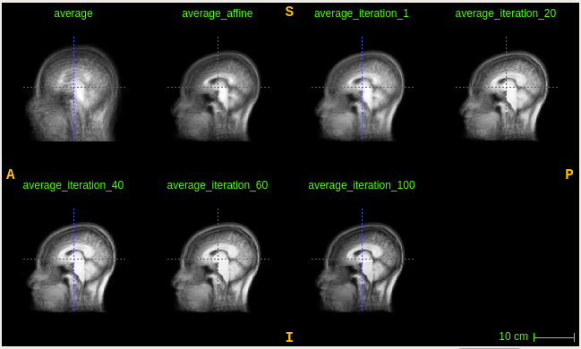

# itkAssignment-VietThan

<p align="center"></p>

<p align="left">
	
	
  	
	
	
</p>

## Process

Highly recommend reading before begin. In a way, this might be the most hack-and-slash method. I did not rely on slurm, partly because the number of jobs from fellow students would have crowded out my jobs, and thankfully my programs weren't so intensive that they couldn't just be run straight from the command line. (I had a slow weekend anyway). Here are the process for each question.

### Question 1:

1. Downloaded from the Box link
2. Delete duplicates according to attached spreadsheet
3. From lowest value to highest, change file number to corresponding incrementing list (See more with [File numbers changed](#file-numbers-changed))

### Question 2:

1. Compile the "average" ITK program
2. Copy the executable to the data folder
3. Runs a variation of the Average script:
   ```bash
   ./average 21 iteration_1_deformed_image_{01..21}.nii average.nii
   ```
4. We now have the originals-average template at "average.nii"

### Question 3:

1. Compile the "affine" ITK program
2. Copy the "affine" executables to the data folder
3. Runs a variation of the affine script (fixed image being the 1st image):
   ```bash
   ./affine 20 KKI2009-01-MPRAGE.nii KKI2009-{02..21}-MPRAGE.nii
   ```
4. Runs a variation of the average script ("average" executable is present):
   ```bash
    ./average 21 KKI2009-01-MPRAGE.nii affine_KKI2009-{02..21}-MPRAGE.nii average_affine.nii
    ```
5. We now have the affines-average template at "average_affine.nii"

### Question 4:

1. Compile the "deformed" ITK program
2. For the 20 affines and the randomly selected image (the first image), runs a variation of the deformed registration script. For example:
   ```bash
   ./deformed average_affine.nii affine_KKI2009-02-MPRAGE.nii image_02.nii 100
   ```
   The script above deformably register the affined of image02 to the affines-average template with 100 iterations and output name will be "deformed_image_02.nii"
3. We now have 21 affined deformably registered affines to the affines-average template (and the 100 iterations).

### Question 5:
The iteration output would have already been handled with the processing in Question 4. So for this one, I check the results.

The iterations will have names being iteration_iterationNum_deformed_outputName

1. For a range of the iterationNum (I did 1, 20, 40, 60, 80, final result), average them:
   ```bash
    ./average 21 iteration_1_deformed_image_{01..21}.nii average_iteration_1.nii
    ```
2. Use ITKSNAP to check if iterations optimize over time. See picture on top to see optimization in action.

## Scripts

1. Average:
   ```bash
    ./average [n] [imgs] [output]
    ```
   - n       - the number of images
   - imgs    - all the images (plurality)
   - output  - the name of the output file
    
2. Affine registration
   ```bash
   ./affine [n] [fixed] [moving]
   ```
   - n       - the number of moving images
   - fixed   - the fixed image name
   - moving  - the names of the moving images (plurality)
   
   
3. Deformed registration (Demons)
   ```bash
   ./deformed [fixed] [moving] [output] [iterNum]
   ```
   - fixed   - the fixed image/template
   - moving  - the moving image
   - output  - part of the name of the output, will form part of the iterations naming
   - iterNum - the number of iterations in registration

## Command line

1. Average
   ```bash
    ./average 21 KKI2009-{01..21}-MPRAGE.nii average.nii
    ```
2. Affine registration
   ```bash
   ./affine 20 KKI2009-01-MPRAGE.nii KKI2009-{02..21}-MPRAGE.nii
   ```
3. Deformed registration
   ```bash
   ./deformed average_affine.nii affine_KKI2009-02-MPRAGE.nii image_02.nii 100
   ```
      
## File numbers changed
Prior to all the computation, after deleting the duplicates, I've renamed the files to make it easier.

- 33 -> 01
- 34 -> 02
- 20 -> 03
- 19 -> 04
- 41 -> 05
- 42 -> 06
- 38 -> 07
- 36 -> 08
- 35 -> 09
- 40 -> 10
- 22 -> 11
- 29 -> 12
- 27 -> 13
- 26 -> 14
- 21 -> 15
- 25 -> 16
- 11 -> 17
- 31 -> 18
- 24 -> 19
- 37 -> 20
- 17 -> 21 
